# Window Coverings for an Eichler Home

Curated August 17, 2026. This is a design-research note, not a product selection. It draws on Eichler preservation guidance, period sales imagery, owner discussions, documented remodels, and visual leads from Pinterest and other sites.

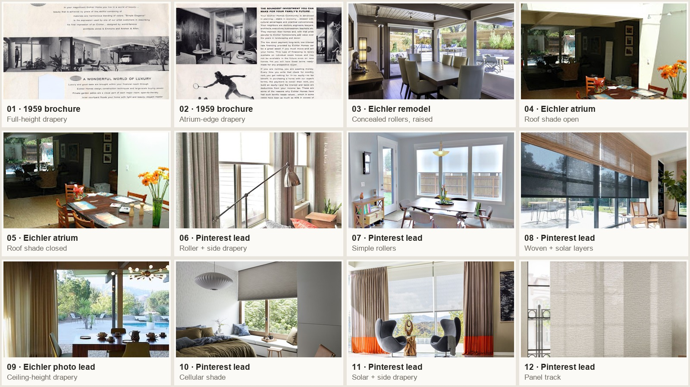

## Short answer

There was not one universal treatment supplied with every Eichler, but a clear hierarchy emerges from the evidence:

1. **No covering at all** on private atrium- and rear-facing glass. This preserves the indoor-outdoor effect and is still common where landscaping supplies privacy.
2. **Simple roller shades**—including solar-screen fabric—are the strongest all-around choice for living, dining, and kitchen glass. They are period-compatible, geometrically quiet, and nearly disappear when raised. Palo Alto's adopted Eichler design guidelines specifically identify interior and exterior roller shades as original window treatments.
3. **Cellular or honeycomb shades** are the common performance choice for bedrooms and uncomfortable single-pane glass. They retract compactly and can provide insulation, privacy, or blackout, though they are a later technology rather than a 1950s detail.
4. **Full-height, ceiling-mounted drapery** is genuinely period-appropriate—not a stylistic compromise. Original brochure photography and owners who found original hardware or fabric support this. The convincing version is tailored and architectural: solid or subtly textured fabric, straight ceiling track, full height, and enough clear wall for the stack.
5. **Panel tracks, vertical blinds, and woven shades** solve particular openings, especially sliders, but each brings a compromise. Panels and verticals leave a visible side stack; woven shades can be bulky when raised and may not provide night privacy.

The best default for this house is therefore **low-profile roller shades in public rooms, blackout cellular shades or lined ceiling-track drapery in bedrooms, and no treatment where the atrium or garden already makes the glass private**.

“Typical” here means repeatedly documented and discussed, not statistically measured; there does not appear to be a comprehensive survey of surviving original Eichler window treatments.

## What the sources establish

### Period evidence

- The [City of Palo Alto's adopted Eichler Neighborhood Design Guidelines](https://www.cityofpaloalto.org/files/assets/public/planning-amp-development-services/eichler-neighood-design-guidelines/2018-04-02_palo-alto-eichler-design-guidelines_adopted-design-guidelines.pdf) say exterior or interior roller shades may be considered because they were original Eichler window treatments (page 94).
- The [1959 Fairglen Eichler sales brochure](https://www.fairgleneichlers.org/floor-plans/) shows simple, full-height drapery at glass walls and atrium openings. The treatment is quiet and vertical—not ruffled, swagged, or mounted just above individual windows.
- In the Eichler Network [bedroom-curtains discussion](https://www.eichlernetwork.com/content/bedroom-curtains), owners describe heavy original fabrics and surviving mechanisms. Another owner argues for ceiling-mounted, floor-to-ceiling drapes in neutral, nubby or sleek fabric as the authentic modernist treatment.

### What owners actually choose

- **Bare glass:** Owners repeatedly report leaving private rear and atrium glass uncovered. A broader [floor-to-ceiling-window discussion](https://www.reddit.com/r/InteriorDesign/comments/1966fy0/what_type_of_window_treatments_do_the_massive/) reaches the same conclusion for modern glass houses: landscape first, shades only where needed.
- **Rollers:** In the Eichler Network [woven-wood/blinds discussion](https://www.eichlernetwork.com/content/bamboo-window-treatments-woven-wood-blinds), roller shades are favored because they cover a large span but virtually disappear at the head. A [documented Eichler remodel on Dwell](https://www.dwell.com/home/eichler-update-e9f74730/7103192149606047744) uses concealed roller shades with insulated glazing.
- **Cellular shades:** Owners in the [bedroom-curtains](https://www.eichlernetwork.com/content/bedroom-curtains) and [woven-wood/blinds](https://www.eichlernetwork.com/content/bamboo-window-treatments-woven-wood-blinds) threads praise the compact stack, crisp pleats, insulation, motorization, and blackout options. Eichler Network's [installer interview](https://www.eichlernetwork.com/blog/ask-expert-window-treatments-modern-world) notes that the low profile fits the tight space around many Eichler windows.
- **Drapery:** The [Eichler Network window-treatment feature](https://www.eichlernetwork.com/article/choice-window-treatments-curtain-call-comfort) recommends tailored full-length drapery near the ceiling, with clean ripple folds and organic neutral fabrics such as linen or cotton duck. Drapery also helps an Eichler's hard surfaces acoustically.
- **Verticals and panel tracks:** Owners report using verticals where blackout or a very wide sloped wall matters, but also describe the side stack and “1980s” association as drawbacks. The Eichler Network feature presents sliding fabric or shoji-like panels as a clean alternative for large doors.
- **Woven wood/bamboo:** Owners like the texture but report high rolled-up bulk, dust, and inadequate privacy after dark unless a liner or second shade is added.

## Comparison

| Treatment | Fit with Eichler architecture | Best use | Main tradeoff |
|---|---|---|---|
| Uncovered glass | Excellent where privacy permits | Atrium and landscaped rear glazing | No glare, heat, privacy, or nighttime control |
| Concealed/open-roll roller | Excellent; original-compatible | Living, dining, kitchen, office | A single solar fabric will not provide reliable privacy at night |
| Cellular/honeycomb | Visually compatible; not period-original | Bedrooms, single-pane glass, odd shapes | Pleated surface remains visible when down; large custom shapes cost more |
| Ceiling-track drapery | Historically authentic when tailored | Bedrooms, media areas, long glass walls | Requires substantial side-stack space and a great deal of fabric |
| Sliding panel track | Clean and functional | Wide sliders and doors | Overlapping panels never disappear completely |
| Vertical blind | Functional but often visually dated | Very wide or sloped walls, strong blackout need | Side stack, many vertical lines, and careful custom cutting at a slope |
| Woven/grass shade | Warm, MCM-adjacent texture | Smaller windows or a decorative layer | Bulk, dust, and weak night privacy without a liner |
| Shutters / two-inch wood blinds | Usually too visually heavy | Rarely the first choice | Interrupt the glass wall and collect dust; large raised stacks reduce the view |

## Starting specification by opening

### Rear and atrium-facing living areas

- Leave glass uncovered if fencing and planting already provide privacy.
- Where glare or heat requires control, use a low-profile roller shade aligned to the structural bays rather than one visually unrelated treatment across the whole wall.
- For daytime solar control, sample screen fabrics at roughly 1%, 3%, 5%, and 10% openness. Lower openness blocks more glare and view; higher openness preserves more view. Test the actual fabric from both sides after dark—an illuminated room is usually visible through solar mesh.
- Keep hardware, cassettes, and side channels in a quiet dark bronze, black, ceiling color, or frame-matching finish.

### Bedrooms and street-facing rooms

- Use blackout cellular shades for the smallest stack and stronger thermal performance.
- Use lined, ceiling-track ripple-fold drapery when acoustic softness and complete coverage matter more than stack size.
- A layered system can combine a light-filtering roller for daytime with blackout drapery or a second room-darkening roller for night.

### Sloped glass and clerestories

- First ask whether the upper trapezoid needs covering. Several owners leave the clerestory clear and shade only the rectangular lower bays.
- Avoid a straight track dropped across the wall below the roof slope; owners specifically object to how it cuts off the cathedral form.
- If the entire gable needs control, obtain a custom drawing for a fixed or operable specialty cellular shade, or accurately graduated vertical vanes. Agree on alignment tolerances before fabrication.

### Sliders and long walls of glass

- Preserve the operating door and decide where the covering will stack before choosing a system.
- Rollers provide the smallest visual stack but may require several coordinated shades across a long span.
- Ripple-fold drapery needs clear wall or a pocket; panel tracks need less fabric fullness but leave overlapping slabs at one side.

### Skylights and glazed atrium roofs

- Use a tensioned or side-guided solar roller so the fabric does not sag.
- Motorization is usually worth considering for high or very large shades. Plan access to batteries, motors, and controls; Eichlers generally do not offer a conventional attic for later service or hidden wiring.

## Details to settle before requesting quotes

- Photograph and dimension every bay, slider, clerestory, beam, handle, and available mounting surface.
- Ask the installer to show the **raised stack or roll diameter** on the drawing—not just the covered elevation.
- Decide whether adjacent shades should align to glass panes, mullions, or structural posts.
- Specify where drapery or panels stack so they do not block a door, switch, return, or view.
- State the actual goal for each opening: view, glare, UV, heat, daytime privacy, night privacy, room darkening, blackout, or insulation.
- For energy performance, compare products with an [Attachments Energy Rating Council (AERC)](https://www.energy.gov/cmei/buildings/articles/new-program-allows-manufacturers-certify-energy-performance-window) rating rather than relying only on fabric marketing.
- Prefer cordless or inaccessible-control systems around children and pets.
- Do not casually fasten upward through an Eichler tongue-and-groove ceiling. Have the installer identify a beam, frame, or other verified mounting substrate and limit fastener depth so the roof assembly is not damaged.

## Visual references

The first five images are documented Eichler sources. The remaining images were found through Pinterest and are included to compare treatment types; Pinterest can detach an image from its original context, so those are visual leads rather than proof of Eichler precedent.

| Reference | Why it is useful |
|---|---|
| [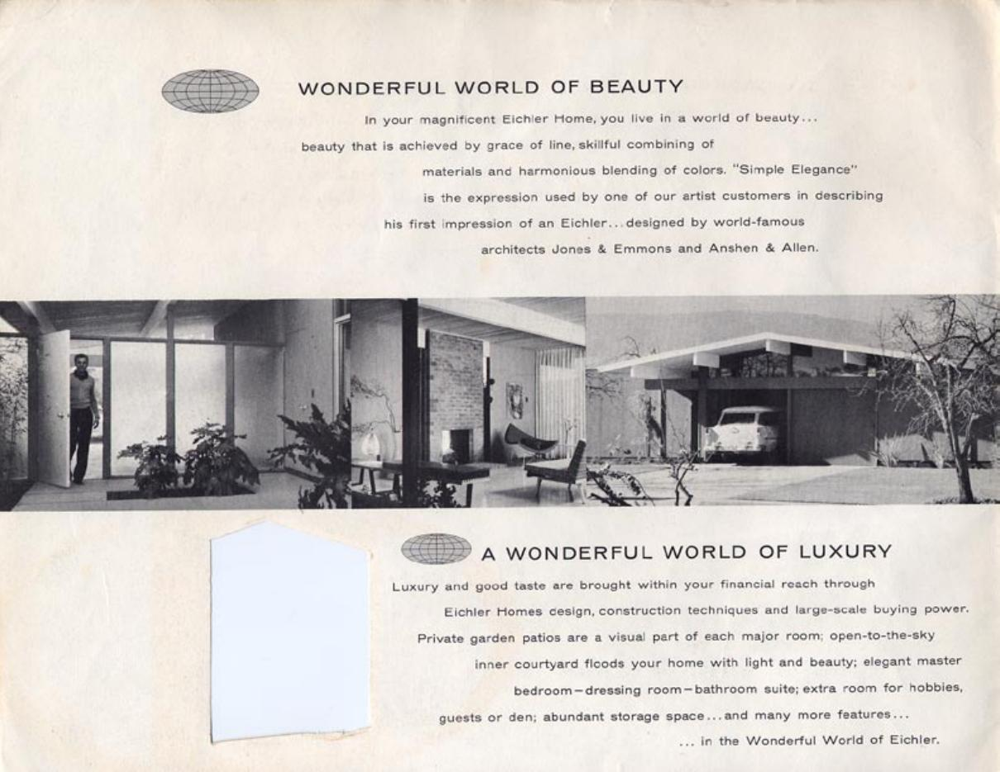](https://www.fairgleneichlers.org/floor-plans/) | **01 — Period full-height drapery.** The fabric drops from ceiling height and reads as an architectural plane. |
| [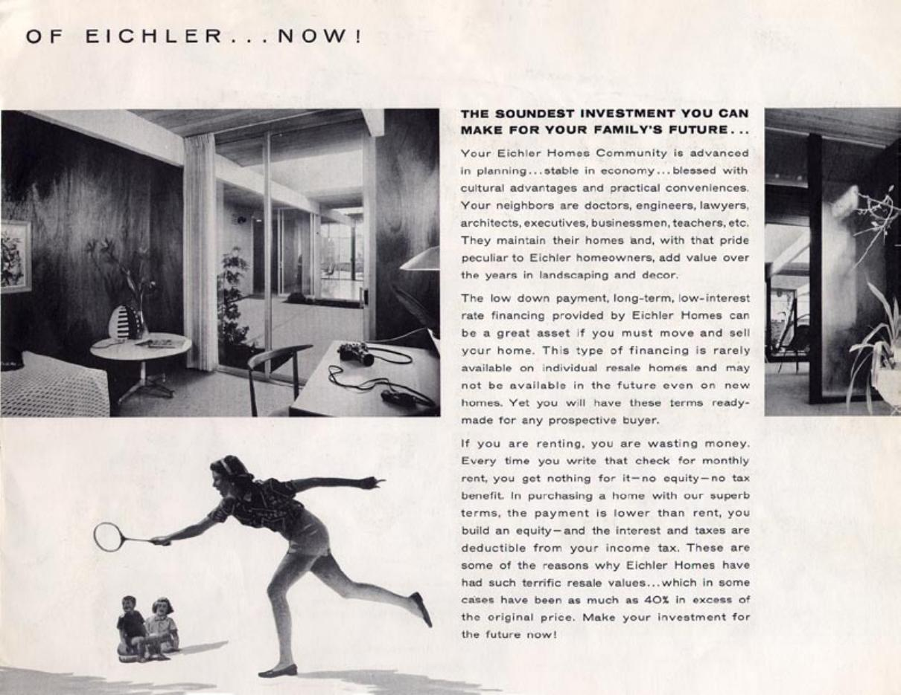](https://www.fairgleneichlers.org/floor-plans/) | **02 — Period atrium-edge drapery.** Useful evidence that curtains and open glass coexisted in original marketing. |
| [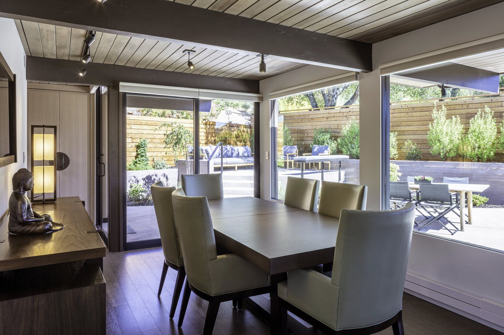](https://www.dwell.com/home/eichler-update-e9f74730/7103192149606047744) | **03 — Concealed rollers.** The raised shades preserve nearly all of the glass and view. |
| [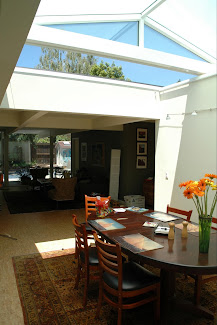](https://atotic.wordpress.com/2010/06/02/eicher-remodel-3/) | **04 — Roof shade open.** A real Eichler atrium-roof solution, shown retracted. |
| [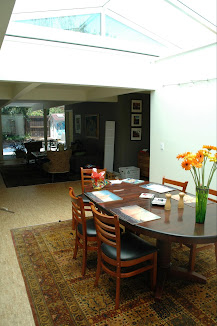](https://atotic.wordpress.com/2010/06/02/eicher-remodel-3/) | **05 — Roof shade closed.** Shows how a translucent overhead treatment changes the same room. |
| [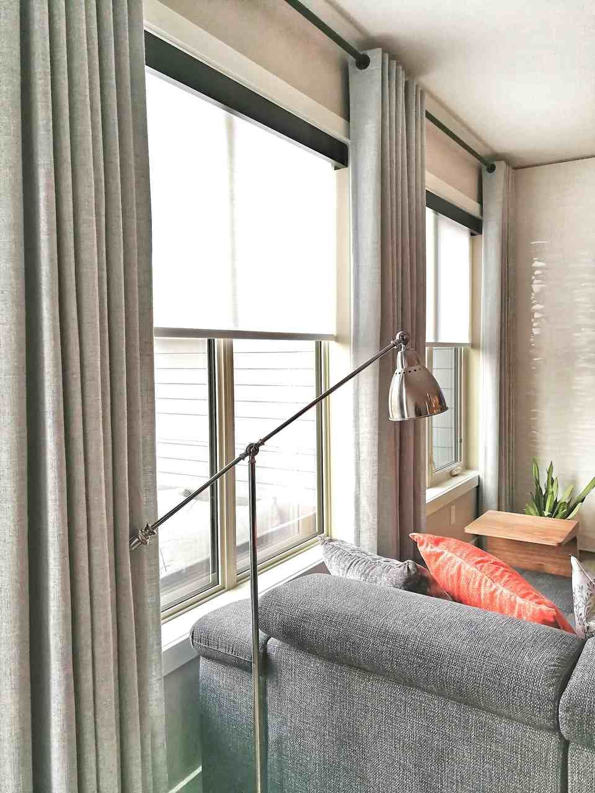](https://www.pinterest.com/pin/504121752054334088/) | **06 — Layered control.** A quiet roller handles the window while narrow side panels add softness. |
| [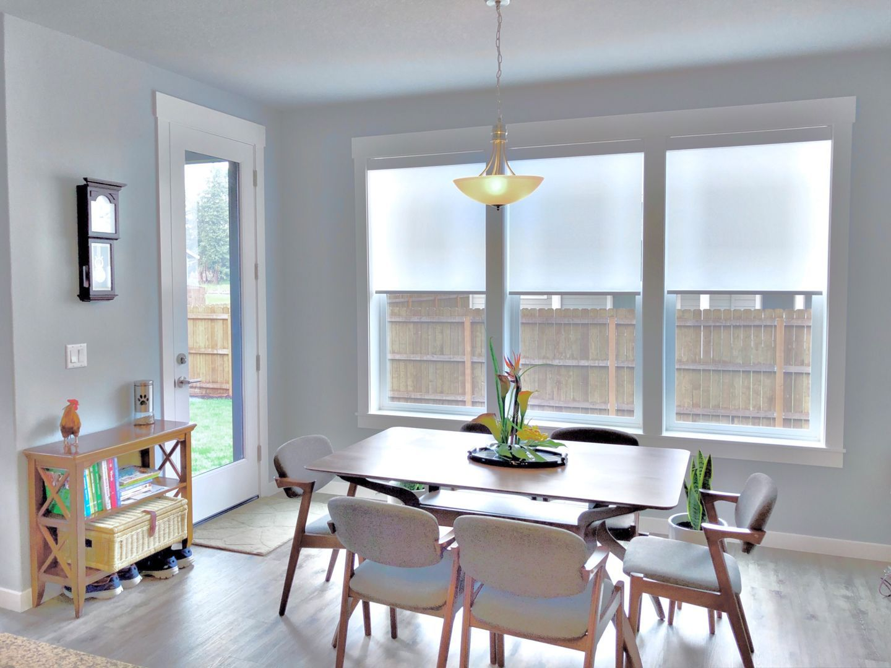](https://www.pinterest.com/pin/372743306666741539/) | **07 — Simple rollers.** A useful plain treatment without decorative hardware. |
| [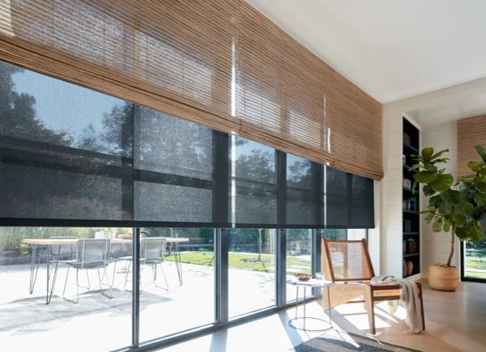](https://www.pinterest.com/pin/627407791867735198/) | **08 — Woven + solar.** Demonstrates the visual richness—and bulk—of a two-layer shade system. |
| [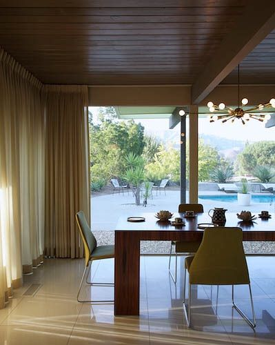](https://www.pinterest.com/pin/316589048781739452/) | **09 — Drapery in a Balboa Highlands Eichler.** The track follows the ceiling height and the fabric stacks beyond the main view. |
| [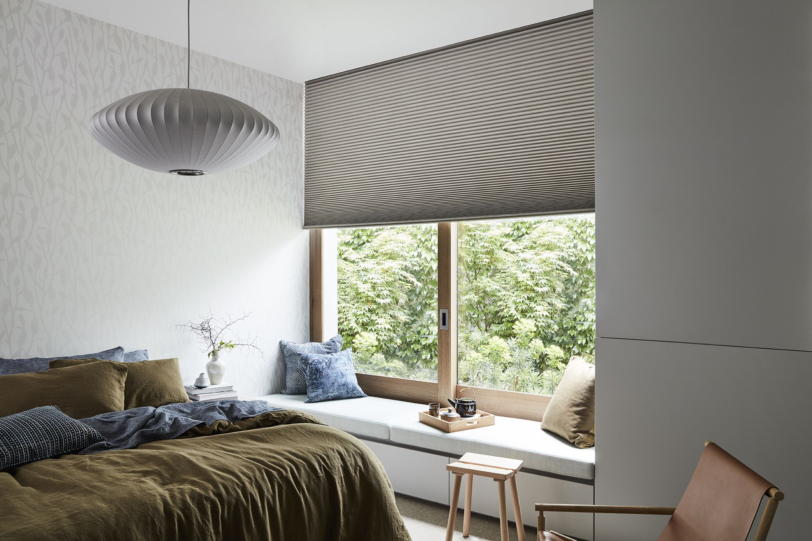](https://www.pinterest.com/pin/155514993367151387/) | **10 — Cellular shade.** Shows the crisp geometry, compact head, and substantial covered surface. |
| [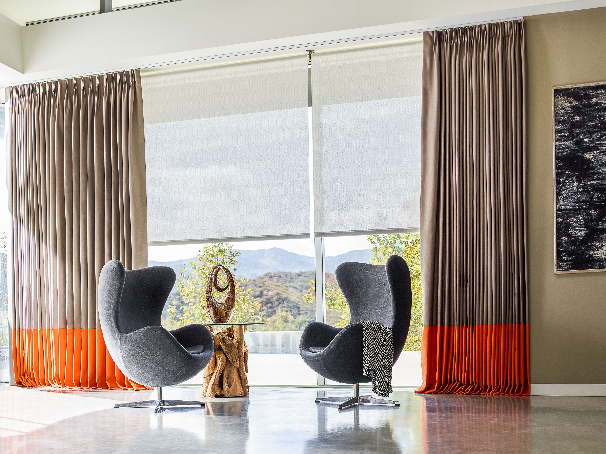](https://www.pinterest.com/pin/112730796906145529/) | **11 — Solar + drapery.** A strong example of separate daytime glare control and a softer/full-privacy layer. |
| [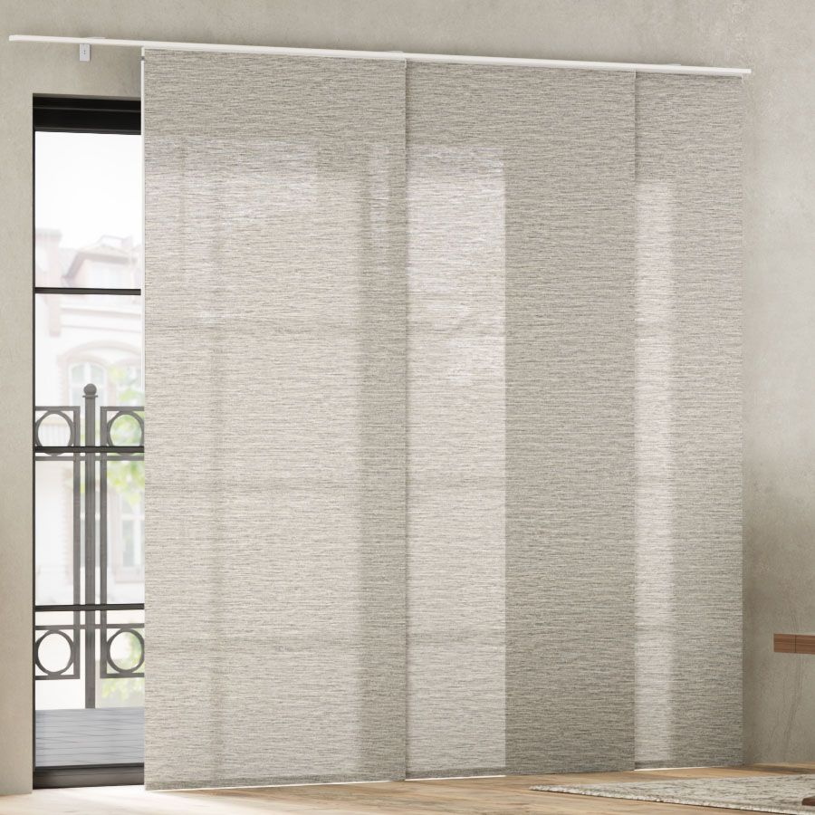](https://www.pinterest.com/pin/322992604543711862/) | **12 — Panel track.** A clean slider treatment, with the remaining overlap and side stack clearly visible. |

## Files and attribution

- `images/eichler/` contains period or documented Eichler references.
- `images/pinterest/` contains Pinterest discoveries used only as visual leads.
- `sources.csv` records the page and source-asset URL for every saved image.
- `contact-sheet.jpg` provides a quick comparison.

These images are collected for private design research. Copyright remains with the photographers, designers, publishers, manufacturers, and archives identified in `sources.csv`. Do not republish or distribute them without checking permission and usage rights.

